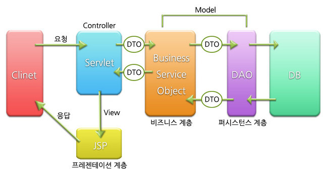

## 실습03
- mvc : model view controller

- 한 가지가 변경되었을 떄 전체 로직을 변경할 필요없이, 해당 역할을 하는 부분만 변경하면 된다.

### 서비스단 생성
- [new] -> service 패키지 -> BoardService.java


```java
package com.example.service;

import com.example.domain.Board;
import com.example.repository.BoardRepository;
import org.springframework.beans.factory.annotation.Autowired;
import org.springframework.stereotype.Service;

import java.util.List;

@Service
public class BoardService {

    @Autowired
    private BoardRepository boardRepository;

    public List<Board> getBoardList(){

        return boardRepository.findAll();
    }
}

```
- 컨트롤러 -> repository 에서 controller -> service -> repository로 변경
- applicationContext.xml : component-scan에서 Controller는 제외한다.
- dispatcher-servlet.xml : component-scan에서 controller만 포함한다.
